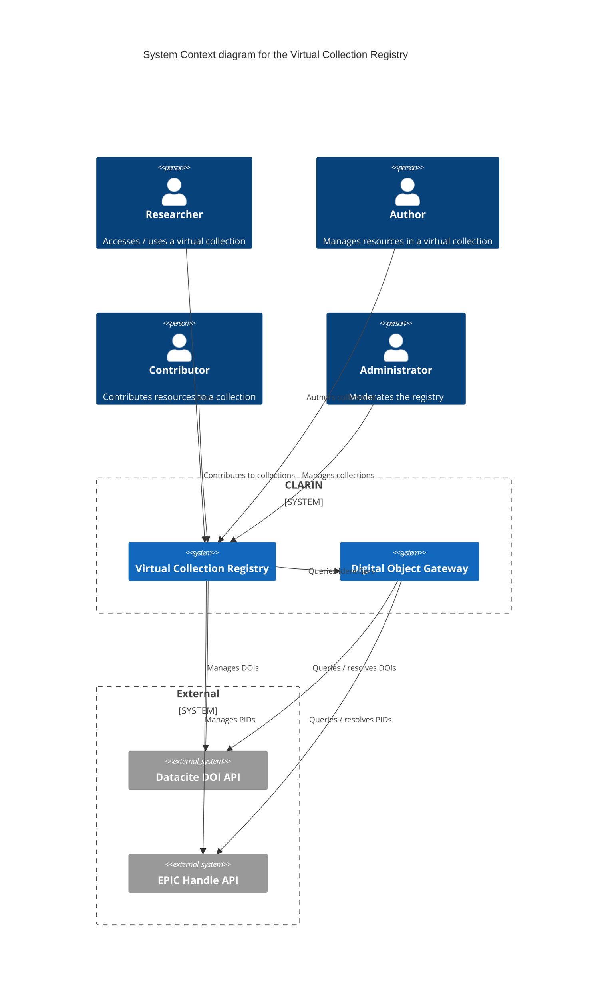

work in progress
  
# System Context 

```mermaid
C4Context
  title System Context diagram for the Virtual Collection Registry
  
  Person(usrResearcher, "Researcher", "Accesses / uses a virtual collection")
  Person(usrAuthor, "Author", "Manages resources in a virtual collection")
  Person(usrContributor, "Contributor", "Contributes resources to a collection")
  Person(usrAdministrator, "Administrator", "Moderates the registry")

  System_Boundary(b1, "CLARIN") {
    System(sysVcr, "Virtual Collection Registry")
    System(sysDog, "Digital Object Gateway")
  }
  System_Boundary(b2, "External") {
    System_Ext(sysDoi, "Datacite DOI API")
    System_Ext(sysHandle, "EPIC Handle API")
  }
  
  Rel(usrResearcher, sysVcr, "Uses")
  Rel(usrAuthor, sysVcr, "Authors collections")
  Rel(usrContributor, sysVcr, "Contributes to collections")
  Rel(usrAdministrator, sysVcr, "Manages collections")
  Rel(sysVcr, sysDog, "Queries Identifiers")
  Rel(sysVcr, sysDoi, "Manages DOIs")
  Rel(sysVcr, sysHandle, "Manages PIDs")
  Rel(sysDog, sysDoi, "Queries / resolves DOIs")
  Rel(sysDog, sysHandle, "Queries / resolves PIDs")
  
   UpdateLayoutConfig($c4ShapeInRow="3", $c4BoundaryInRow="1")
```
