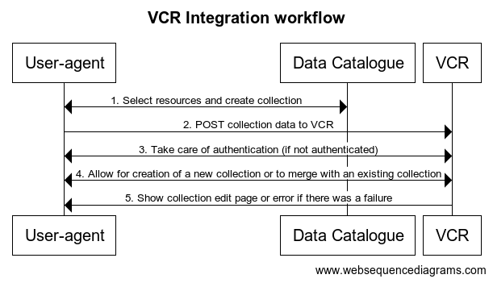
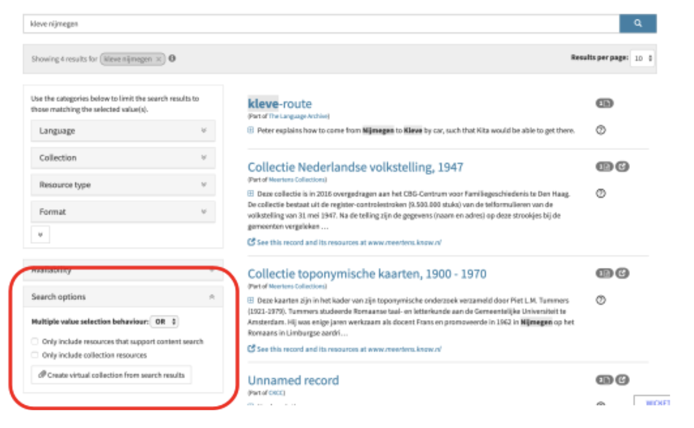
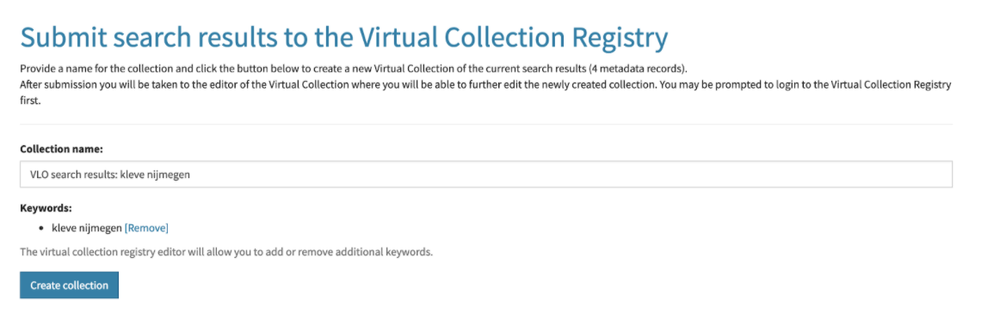

## Introduction
This document aims to provide a description of the virtual collection registry (VCR) submission endpoints, which can be used to create virtual collections from external applications.

_Note_: The original version of this document was managed via [google documents](https://docs.google.com/document/d/1HYNDhtNIamcNP3kQg4IgLhcOk7uH60Ij5PJVksJLADM/). This markdown version
replaces the google drive version.

## Submission endpoints
Send a POST request, with form urlencoded parameters, to any of the following two endpoints:
* `https://<domain_name>/<context_path>/submit/extensional`, to submit an extensional collection
* `https://<domain_name>/<context_path>/submit/intensional`, to submit an intensional1 collection

### Beta instance
A beta instance of the virtual collection registry is available at https://collections.clarin-dev.eu, with an empty context path, resulting in the following endpoint URLs:
* `http://collections.clarin-dev.eu/submit/extensional` 
* `http://collections.clarin-dev.eu/submit/intensional` 

### Production instance
The virtual collection registry production instance is available at https://collections.clarin.eu, with an empty context path, resulting in the following endpoint URLs:
* `http://collections.clarin.eu/submit/extensional` 
* `http://collections.clarin.eu/submit/intensional`

### Parameters
The following parameters are supported and should be sent in form urlencoded form:

| Name | Type | Required | Endpoints |
|------|------|----------|-----------|
| name  | String | Yes | Extensional + Intensional |
| description | String | Yes |Extensional + Intensional |
<<<<<<< HEAD
=======
| original_query | String | No |Extensional |
>>>>>>> 1.6.0
| keyword | List&lt;String&gt; | No | Extensional + Intensional |
| purpose | Controlled Vocabulary | No | Extensional + Intensional |
| reproducibility | Controlled Vocabulary | No | Extensional + Intensional |
| reproducibilityNotice | String | No | Extensional + Intensional |
| metadataUri | List&lt;String&gt; or List&lt;JSON&gt; | Yes | Extensional |
| resourceUri | List&lt;String&gt; or List&lt;JSON&gt; | Yes | Extensional |
| queryDescription | String | Yes | Intensional |
| queryUri | String | Yes | Intensional |
| queryProfile | String | Yes | Intensional |
| queryValue | String | Yes | Intensional |

Notes:

* Lists: `List<String>` or `List<JSON>`, must be specified by repeating the parameter key multiple times, e.g. `metadataUri=...&metadataUri=...`
  * For a `List<String>` the `key=value` pair can be provided one or more times, where `value` must be a single string value: 
  `key=value_1&key=value_2&...`
  * For a `List<JSON>` the `key=value` pair can be provided one or more times, where `value` must be a single JSON object :
  `key={"prop1": "val_1", ...}&key={"prop2": "val_2", ...}&...`
* Purpose Controlled vocabulary (default value marked with *): 
  * `RESEARCH, REFERENCE*, SAMPLE, FUTURE_USE`
* Reproducibility Controlled vocabulary (default value in bold): 
  * `INTENDED*, FLUCTUATING, UNTENDED`
* Both the metadataUri and resourceUri fields support JSON as its value to specify additional metadata (uri, label and description) describing the resource or metadata field.
  * JSON format: `{"uri": "", "label": "", "description": ""}`
  * As a list of fields: `metadataUri={"uri": "", "label": "", "description": ""}&metadataUri={"uri": "", "label": "", "description": ""}&...`
<<<<<<< HEAD

=======
* For extenstional collections the `original_query` field can be used to link the submitted resources to the query used to generate this collection.
>>>>>>> 1.6.0
### Examples
Curl example (against a local instance (http://localhost:8080/vcr)with basic authentication (user1:user1)):

```
curl -v \
-u user1:user1 \
-d 'name=test&metadataUri=http://www.clarin.eu/1&metadataUri=http://www.clarin.eu/2&resourceUri=http://www.clarin.eu/&&description=test-collection&keyword=&purpose=&reproducibility=' \
       http://localhost:8080/vcr/service/submit/extensional
```

## Workflow

Figure 1 shows a sequence diagram describing the interaction between the user (user-agent), the service to be integrated with the VCR and the VCR itself. There is a clear distinction between step 1 and 2, which happen on the external service side before sending the user-agent to the VCR, either n the same or in a new browser window, for the remainder of the steps. Therefore the actual integration with the external service is focussed at step 1 and 2 in the sequence diagram. 


<<<<<<< HEAD
=======

>>>>>>> 1.6.0
Diagram [source](https://www.websequencediagrams.com/?lz=dGl0bGUgVkNSIEludGVncmF0aW9uIHdvcmtmbG93CgpVc2VyLWFnZW50LT5TZXJ2aWNlOiAxLiBzZWxlY3QgcmVzb3VyY2VzIGFuZCBjcmVhdGUgY29sbGVjdGlvbgoALActPgA-CjogMi4gSFRUUCAyMDAgT0sAVg1WQ1I6IDMuIFBPU1Qgd2l0aCBwYXJhbWV0ZXJzIHRvIFZDUgpWQ1IAIgdQcm9jZXNzIDQuIGlucHV0AIEABXN0b3JlIGluIHNlc3Npb24AJQs1LiBMb2dpAAcMNi4gUmVkaXJlY3QgdG8AgTALAIFHBmlvbiBwYWdlIABwBgCBOgw3AIE7C29rIG9yAIFPBmVycm9yICg0eHggb3IgNXh4KQ&s=default)

Note:
* Step 5: Login is only required if no authenticated session is available and is not specified in detail. This workflow can be quite complicated, especially in the SAML case. For the integration of an external service this is not very relevant since this is taken care of completely on the VCR side.
<<<<<<< HEAD
* Since authentication is implemented via SAML SSO, all communication must happen via the user-agent, including the POST from the service to the VCR endpoint (step 3). The easiest way to achieve this is via form on the external application side. See integration section for an example.
=======
* Since authentication is implemented via SAML SSO, all communication should happen via the user-agent, including the POST from the service to the VCR endpoint (step 3). The easiest way to achieve this is via form on the external application side. See integration section for an example.
>>>>>>> 1.6.0

## Integration

Integration of the VCR in an external application (portal, catalog, …) typically creates an extensional collection. This 
requires functionality in the external application to gather a set of links. This can be a search result, a cherry picking 
approach to select individual links or a combination. In the end this is really up to the external application.

One consideration is to send links to individual resources or send links to landing pages with a collection of links. 

After collecting a set of links in the external application, the extensional collection endpoint can be called with the 
following minimal set of required parameters:

| Name | Type | Required |
|------|------|----------|
| name | String | Yes |
| description | String | Yes |
| metadataUri | List&lt;String&gt; | Yes |
| resourceUri | List&lt;String&gt; | Yes |

Notes:
* A set of keywords is optional but is prefered.
* Purpose and reproducibility can be omitted in most cases as long as the defaults (`purpose= REFERENCE` and `reproducibility=INTENDED`) make sense.

<<<<<<< HEAD

### Form example

This is an example of how you can implement a form, served by an external application, to submit a virtual collection:
=======
Both the production and beta VCR instances are running with SAML based (shibboleth) authentication. This relies heavily
on browser driven workflows, thus it is advisable to perform the submission POST request from the user browser. This ensures
the authentication workflow functions smoothly. One way to achieve this, is by adding all POST data in a form. A simple example
is shown in the next section.

### Form example

This is an example of how one could implement a form, served by an external application, to submit a virtual collection to the VCR:
>>>>>>> 1.6.0
```
<form id="virtualCollectionForm" method="post" enctype="application/x-www-form-urlencoded" name="vcrForm" action="https://collections.clarin.eu/submit/extensional"> 
    <input id="collectionName" type="text" name="name" value="Your collection name">
    <input id="collectionDescription" type="text" name="description" value="Your collection description">
    <input type="hidden" name="metadataUri" value="{&quot;uri&quot;:&quot;https://1.uri.com&quot;,&quot;label&quot;:&quot;uri 1&quot;,&quot;description&quot;:null}">         
    <input type="hidden" name="metadataUri" value="{&quot;uri&quot;:&quot;https://2.uri.com&quot;,&quot;label&quot;:&quot;uri 2&quot;,&quot;description&quot;:null}">
    ...             
    <input type="submit" value="Submit">
</form>
```

### Example integration

Figure 2 and 3 show an example integration between the CLARIN VLO and the VCR. 

Figure 2 shows how to create a virtual collection based on some search result (Kleve + Nijmegen):


 After clicking the highlighted “Create virtual collection from search result” button, the user is redirected to a confirmation page, shown in figure 3, before being sent to the VCR:


